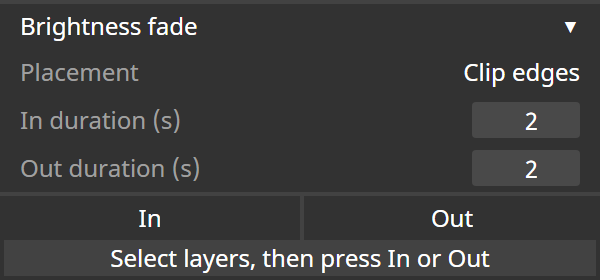

# In / Out for disguise Designer

Минималистичный локальный плагин для disguise Designer, который добавляет
автоматизацию Brightness (для видео-layers) или Volume (для audio layers)
непосредственно к выделенным layers. Плагин не
требует сборки, внешних библиотек или подключения к интернету.

- **In** — Brightness/Volume от `0` до `1`;
- **Out** — Brightness/Volume от `1` до `0`;
- audio layers получают fade громкости, видео-layers — fade яркости;
- обработка всех выделенных layers одной командой;
- отдельная длительность для In и Out в секундах;
- размещение по границам layer или относительно playhead;
- cubic-интерполяция ключевых точек.

## Механика размещения

Сначала выделите один или несколько layers в текущем треке Designer. Плагин
получает их через `guisystem.selectedLayers` и изменяет sequence `brightness`
каждого выбранного layer. Если у layer нет `brightness` (например, audio
layer), используется sequence `volume`.

- **Clip edges / In:** от начала layer вперёд.
- **Clip edges / Out:** заканчивается на конце layer.
- **At playhead / In:** заканчивается в позиции playhead.
- **At playhead / Out:** начинается в позиции playhead.

В режиме `At playhead` обрабатываются только выбранные layers, внутри которых
сейчас находится playhead. Остальные выбранные layers пропускаются. Переход
ограничивается границами layer.

Длительность вводится в секундах. Плагин переводит секунды в beats отдельно
для каждого участка через `timeToBeat`/`beatToTime`, поэтому изменение темпа
трека учитывается корректно.

## Установка

1. Скачайте `d3-in-out-plugin.zip` из последнего GitHub Release.
2. Распакуйте архив в корневой каталог d3-проекта, открытого в Designer.
3. Убедитесь, что итоговая
   структура должна быть без дополнительного вложенного каталога:
   `{project_root}/plugins/d3-in-out/index.html`,
   `{project_root}/plugins/d3-in-out/disguise-ui.css` и
   `{project_root}/plugins/d3-in-out/d3plugin.json`.
4. Закройте окно Plugin Launcher и откройте его снова. Если
   плитка не появилась, перезапустите Designer с этим проектом.
5. В Plugin Launcher выберите **In Out**.
6. Выделите нужные layers, выберите способ размещения, задайте длительность и
   нажмите **In** или **Out**.

Не копируйте внешний каталог `d3inout` целиком: Designer сканирует только
непосредственные подпапки своего каталога `plugins`, содержащие `index.html`.

## Правила изменения ключей

- `In duration` и `Out duration`: от `0.1` до `3600` секунд;
- ключи внутри нового участка удаляются, чтобы не искажать cubic-переход;
- существующие ключи Brightness/Volume за пределами участка сохраняются;
- значения интерфейса сохраняются локально в окне плагина;
- операция отменяется штатной командой Undo в Designer.

## Совместимость и проверка

Реализация использует официальный Python Execution API:
`POST /api/session/python/execute`. Она рассчитана на версии Designer, где
доступны Plugin API, `guisystem.selectedLayers`, `trackTime()` и методы
`FieldSequence`/`KeySequence`.

Перед использованием на шоу проверьте плагин в тестовом проекте именно на той
версии Designer, которая будет работать на площадке. В этом репозитории нет
запущенного Designer, поэтому реальная запись ключей и поведение общего Undo
должны быть подтверждены на целевой машине.

## Структура репозитория

- `plugins/d3-in-out/index.html` — интерфейс и логика плагина;
- `plugins/d3-in-out/disguise-ui.css` — стили в духе виджетов Designer;
- `plugins/d3-in-out/d3plugin.json` — метаданные для Plugin Launcher;
- `d3-in-out-plugin.zip` — готовый установочный архив;
- `CHANGELOG.md` — история публичных версий.

## Лицензия

[MIT](LICENSE)
